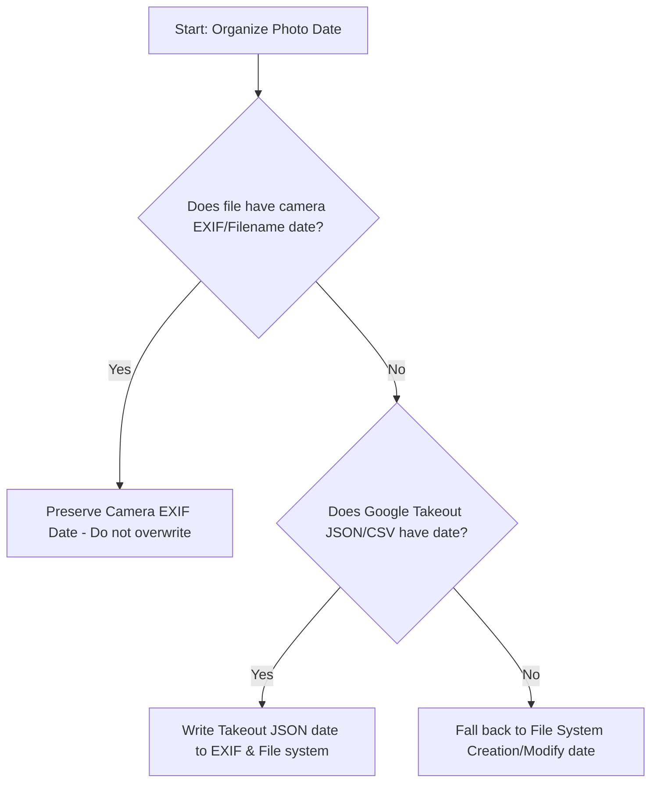

# Google Photos Takeout Metadata & Timestamp Guide 📸⏱️

When organizing a Google Takeout export using tools like `gpth` (Google Photos Takeout Helper), you will often encounter discrepancies between the photo's file metadata (EXIF/Filename) and Google Photos' exported metadata (JSON/CSV files).

This guide captures key learnings on why these differences happen and outlines best practices for resolving them.

---

## 🔍 The Two Metadata Sources

When you process Google Photos Takeout, you are dealing with two distinct metadata sources:

| Source | Description | Accuracy | Reliability |
| :--- | :--- | :--- | :--- |
| **Original EXIF / Filename** | Metadata written directly into the file headers by the camera hardware at the moment of capture, or encoded in the filename (e.g. `IMG_YYYYMMDD_HHMMSS`). | **Highest (Ground Truth)** | Extremely high (immutable unless edited manually). |
| **Google Photos Database (JSON/CSV)** | Metadata stored in Google's cloud database, exported as sidecar `.json` files or tabular `.csv` files. | **Variable** | Low to medium (susceptible to upload lag, manual web edits, and timezone shifts). |

---

## ⚠️ Why Do Mismatches Happen?

If you compare the internal camera EXIF timestamp against Google Photos' JSON/CSV database records, you will often find shifts (ranging from a few minutes to exactly a day). These shifts occur for several reasons:

1. **Timezone Upload Shifts:** If a photo was taken while traveling (in timezone A) but was uploaded or synced later (in timezone B), Google Photos might record the `takenAt` time in its database relative to the upload timezone, causing a shift.
2. **Metadata Stripping on Upload:** Certain apps (like WhatsApp, Snapchat, or web downloads) strip EXIF metadata before upload. Google Photos then infers a date (often the time the file was saved or uploaded) which is different from the actual event.
3. **Manual Edits on Google Photos Web:** If you manually change a photo's date/time in the Google Photos app or web UI, Google saves this new date in its database (JSON/CSV) but does **not** write it back into the actual photo file payload.

---

## 🛡️ Best Practice: Which Timestamp to Follow?

### Rule of thumb: **Prioritize Camera EXIF/Filename over Google's Database.**

Always use a tiered priority system when fixing dates:



### 1. If Camera EXIF is Present (Most Photos):
* **Action:** **Leave it alone.** Do not overwrite original EXIF data with Google's database dates.
* **Why:** The internal EXIF `DateTimeOriginal` tag is the absolute physical record of when the photo was shot.

### 2. If EXIF is Missing (Screenshots, WhatsApp, Snapchat):
* **Action:** **Use the Google Photos JSON/CSV.**
* **Why:** Since these files have no camera metadata, the Google Photos JSON/CSV is your only record of when they were added/taken.
* **Note:** Google Photos now exports certain files (like edited photos or shared album items) with non-standard JSON extensions like `.supplemental-metadata.json` or `.sup.json`. These must be copied/renamed to `.json` so tools like `gpth` can read them.

---

## 🛠️ Handy ExifTool Commands

### 1. Apply File Modify Date to EXIF (Only for files missing dates)
Run this command immediately after running `gpth` (which sets the file modification date correctly from the JSON files). The `-if` check prevents overwriting existing EXIF dates:
```bash
exiftool -overwrite_original -r -if 'not defined $DateTimeOriginal' -P "-AllDates<FileModifyDate" "your/output/folder/"
```

### 2. Directly Merge standard Takeout JSON into an Image
To manually copy the exact date and location from a Google Takeout JSON sidecar into a photo:
```bash
exiftool -overwrite_original -d %s -tagsfromfile "path/to/photo.json" \
  "-DateTimeOriginal<PhotoTakenTimeTimestamp" \
  "-FileModifyDate<PhotoTakenTimeTimestamp" \
  "-GPSLatitude<GeoDataLatitude" \
  "-GPSLongitude<GeoDataLongitude" \
  "-GPSAltitude<GeoDataAltitude" \
  "path/to/photo.jpg"
```
