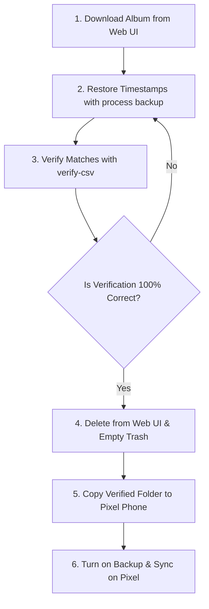

# Google Photos Safe Pixel Re-upload & Deletion Guide 📱⚡

This guide outlines a bulletproof workflow to free up your Google Account storage quota by downloading your original-quality photos, restoring their filesystem timestamps, deleting them from the cloud, and re-uploading them via a storage-exempt Google Pixel phone.

Using this method prevents any data loss and ensures that your photos remain in your Google Photos library at original quality without counting toward your Google storage quota.

---

## 🏗️ High-Level Re-upload Workflow



---

## 🛠️ Step-by-Step Guide

### Step 1: Choose Your Download Method

> [!IMPORTANT]
> **Have you ever manually edited a photo's date or time inside the Google Photos web/app?**
> - **No (clean library):** Use the **Web UI** method below. It is simpler and more reliable for a single album.
> - **Yes (edited dates/timezones):** Use **Google Takeout** instead. Go straight to the Google Takeout workflow below. Web UI downloads will **not** embed corrected timestamps into the EXIF headers of edited photos, meaning they will revert to the original camera date upon re-upload.

---

#### Option A: Web UI Download (for unedited libraries)
1. Open your browser and go to [photos.google.com](https://photos.google.com).
2. Open the album you want to process (e.g., `T2`).
3. Click the **3 dots** in the top-right corner.
4. Click **Download all**.
5. Extract (unzip) the downloaded zip file into a local directory (e.g. `/path/to/your/photos`).

> [!NOTE]
> Web downloads preserve the original camera EXIF metadata inside the files. However, the filesystem modification dates (`mtime`) are reset to the download date and must be restored using `process backup`.

#### Option B: Google Takeout (for libraries with edited dates)
1. Go to [takeout.google.com](https://takeout.google.com) and request an export for Google Photos only.
2. Download **all** ZIP parts of the export (e.g., `...-3-001.zip`, `...-3-002.zip`, etc.).
3. Extract each ZIP part into separate folders (e.g., `Takeout`, `Takeout-2`).
4. **Merge** all parts into a single folder using rsync:
   ```bash
   rsync -a "/path/to/Takeout-2/Google Photos/Album/" "/path/to/Takeout/Google Photos/Album/"
   ```
5. Run the **Takeout** workflow (skip to Step 2B below) instead of Step 2.

> [!CAUTION]
> Google Takeout splits large exports across multiple ZIP files. A photo can land in ZIP Part 1 while its companion metadata JSON ends up in ZIP Part 2. **You must merge all extracted folders before running `process takeout`**, otherwise most files will be skipped.

---

### Step 2: Restore the Filesystem Timestamps
To correct the filesystem dates of the web-downloaded files, run the `process backup` command. This scans your downloaded directory, matches the files by their filenames to the CSV metadata, and restores their original modification times (`os.utime`):

```bash
# Using the script directly
python3 cleaner.py process backup --csv your_metadata.csv --dir "/path/to/your/photos"

# Or using the globally installed CLI
gp-cleaner process backup --csv your_metadata.csv --dir "/path/to/your/photos"
```

---

### Step 2B: Merge Google Takeout Metadata (For Option B)
If you downloaded your library via Google Takeout, use `process takeout` with your target timezone offset (e.g. `+05:30` for India Standard Time) to merge the sidecar JSON metadata and correct the EXIF headers and filesystem dates:

```bash
# Using the script directly
python3 cleaner.py process takeout --dir "/path/to/Takeout/Google Photos" --timezone "+05:30"

# Or using the globally installed CLI
gp-cleaner process takeout --dir "/path/to/Takeout/Google Photos" --timezone "+05:30"
```

If you ever need to force-shift the timezone of already modified takeout photos to a different timezone (e.g., to repair photos whose timestamps were incorrectly written to UTC), use the recovery command:
```bash
gp-cleaner process recover-timezone --dir "/path/to/Takeout/Google Photos" --timezone "+05:30"
```

---

### Step 3: Verify the Timestamps Match
Before deleting anything from the cloud, audit the directory against the CSV to ensure that every single file is present and its metadata is completely correct:

```bash
# Using the script directly
python3 cleaner.py metadata verify-csv --csv your_metadata.csv --dir "/path/to/your/photos"

# Or using the globally installed CLI
gp-cleaner metadata verify-csv --csv your_metadata.csv --dir "/path/to/your/photos"
```

* **Verify the output:** Look for a success rate close to 100% (e.g., `Matches: 585` or close to it, and `Photos not found in CSV: 0`). Once verified, you are **100% assured** that your local files are complete, correct, and ready.

---

### Step 4: Delete the Photos from Google Photos Cloud
To avoid duplicate matching and free up space, delete the photos from the cloud before placing them on your Pixel phone.

> [!WARNING]
> If you copy the photos to your Pixel phone *before* deleting them from Google Photos, the cloud deletion might automatically delete the local copies from your phone via cloud sync. Keep the files **only on your computer** during this step.

1. Go to [photos.google.com](https://photos.google.com) on your computer.
2. Select all the photos in the album and click **Delete** (move to Trash).
3. Go to the **Trash** folder in the left sidebar and click **Empty trash**. This completely clears them from Google's database so they can be re-uploaded as new photos.

---

### Step 5: Transfer the Photos to the Pixel
1. Connect your Pixel phone to your computer via USB.
2. Copy the verified local folder (`T2_Web`) from your computer to a storage directory on your Pixel phone (e.g., `Pictures/T2_Reupload` or `Downloads/T2_Reupload`).

---

### Step 6: Enable Backup on the Pixel
1. Open the **Google Photos app** on your Pixel phone.
2. Go to **Library** -> **Photos on device** (Device Folders).
3. Open the **`T2_Reupload`** folder.
4. Toggle **Backup & Sync** to **ON**.

Your Pixel phone will now upload the photos back to Google Photos. Because they are uploaded from a qualified Pixel device, they will not consume any storage quota.

---

## 🛠️ Rebuilding the Global CLI Binary (Optional)
If you made code changes in your workspace (such as the timezone offset and file filtering fixes) and want your globally installed `gp-cleaner` executable to include them, rebuild the binary using PyInstaller:

```bash
# 1. Compile the new binary from the workspace
pyinstaller --onefile cleaner.py --name gp-cleaner

# 2. Overwrite the global CLI in your bin path
sudo cp dist/gp-cleaner /usr/local/bin/gp-cleaner
```

---

## ⚠️ Google Takeout vs. Web UI Downloads (Metadata Details)

When executing this workflow, keep in mind how Google handles metadata in Web UI downloads vs. Google Takeout exports:

### 1. Filesystem Date (`FileModifyDate`) vs. Internal EXIF (`DateTimeOriginal`)
* **Google Photos Upload Behavior:** When you upload photos to Google Photos, the cloud service prioritizes reading the internal **EXIF `DateTimeOriginal`** tag. It only falls back to the filesystem modification date (`FileModifyDate`/`mtime`) if the EXIF header is completely missing.
* **Finder/OS display:** Your operating system Finder/Explorer displays the filesystem modified time, which can make files in different directories look identical even if their internal EXIF data differs.

### 2. The Differences
* **Web UI Album Downloads:**
  * **Pros:** Easier to download, downloaded as a single ZIP with no filename truncation or duplicate index misalignment.
  * **Cons:** Google **does not** write corrected database timestamps (such as manual timeline edits or timezone shifts) into the internal EXIF headers of unedited photos. The tool's `process backup` command only corrects the filesystem modified date (`os.utime`), meaning Google Photos will revert those timeline shifts upon re-upload.
* **Google Takeout Exports:**
  * **Pros:** Standardizes and exports all database metadata in JSON companions. When merged (resolving the split ZIP parts) and processed using `process takeout`, the tool uses `exiftool` to write corrected timestamps **directly into the internal EXIF headers**.
  * **Cons:** Splits large folders into multiple ZIPs, meaning you must combine them (e.g. merging `Takeout-2` into `Takeout`) before processing.

> [!TIP]
> Always verify your folder using `gp-cleaner metadata verify-takeout` or `gp-cleaner metadata verify-csv`. If you have shifted dates on your timeline, processing a merged **Google Takeout export** is the most bulletproof way to preserve them.

