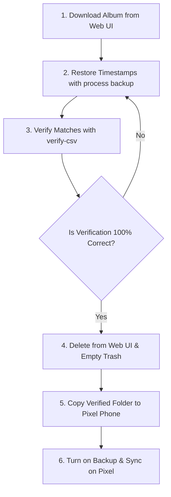

# Google Photos Safe Pixel Re-upload & Deletion Guide 📱⚡

This guide outlines a bulletproof workflow to free up your Google Account storage quota by downloading your original-quality photos, restoring their filesystem timestamps, deleting them from the cloud, and re-uploading them via a storage-exempt Google Pixel phone.

Using this method prevents any data loss and ensures that your photos remain in your Google Photos library at original quality without counting toward your Google storage quota.

---

## 🏗️ High-Level Re-upload Workflow



---

## 🛠️ Step-by-Step Guide

### Step 1: Download the Album from Google Photos Web (Not Takeout)
Google Takeout is notoriously buggy, splits downloads into multiple parts, and frequently misses files. For specific albums, downloading directly from the Google Photos Web UI is much more reliable.

1. Open your browser and go to [photos.google.com](https://photos.google.com).
2. Open the album you want to process (e.g., `T2`).
3. Click the **3 dots** in the top-right corner.
4. Click **Download all**.
5. Extract (unzip) the downloaded zip file into a local directory on your computer (e.g. `/Users/hiijitesh/Downloads/T2_Web`).

> [!NOTE]
> Web downloads preserve all internal EXIF metadata (camera model, GPS coordinates, and captured date) inside the files. However, the filesystem creation/modification dates (`mtime`) are reset to the download date.

---

### Step 2: Restore the Filesystem Timestamps
To correct the filesystem dates of the web-downloaded files, run the `process backup` command. This scans your downloaded directory, matches the files by their filenames to the CSV metadata, and restores their original modification times (`os.utime`):

```bash
# Using the script directly
python3 cleaner.py process backup --csv T2-hiijitesh.csv --dir "/Users/hiijitesh/Downloads/T2_Web"

# Or using the globally installed CLI
gp-cleaner process backup --csv T2-hiijitesh.csv --dir "/Users/hiijitesh/Downloads/T2_Web"
```

---

### Step 3: Verify the Timestamps Match
Before deleting anything from the cloud, audit the directory against the CSV to ensure that every single file is present and its metadata is completely correct:

```bash
# Using the script directly
python3 cleaner.py metadata verify-csv --csv T2-hiijitesh.csv --dir "/Users/hiijitesh/Downloads/T2_Web"

# Or using the globally installed CLI
gp-cleaner metadata verify-csv --csv T2-hiijitesh.csv --dir "/Users/hiijitesh/Downloads/T2_Web"
```

* **Verify the output:** Look for a success rate close to 100% (e.g., `Matches: 585` or close to it, and `Photos not found in CSV: 0`). Once verified, you are **100% assured** that your local files are complete, correct, and ready.

---

### Step 4: Delete the Photos from Google Photos Cloud
To avoid duplicate matching and free up space, delete the photos from the cloud before placing them on your Pixel phone.

> [!WARNING]
> If you copy the photos to your Pixel phone *before* deleting them from Google Photos, the cloud deletion might automatically delete the local copies from your phone via cloud sync. Keep the files **only on your computer** during this step.

1. Go to [photos.google.com](https://photos.google.com) on your computer.
2. Select all the photos in the album and click **Delete** (move to Trash).
3. Go to the **Trash** folder in the left sidebar and click **Empty trash**. This completely clears them from Google's database so they can be re-uploaded as new photos.

---

### Step 5: Transfer the Photos to the Pixel
1. Connect your Pixel phone to your computer via USB.
2. Copy the verified local folder (`T2_Web`) from your computer to a storage directory on your Pixel phone (e.g., `Pictures/T2_Reupload` or `Downloads/T2_Reupload`).

---

### Step 6: Enable Backup on the Pixel
1. Open the **Google Photos app** on your Pixel phone.
2. Go to **Library** -> **Photos on device** (Device Folders).
3. Open the **`T2_Reupload`** folder.
4. Toggle **Backup & Sync** to **ON**.

Your Pixel phone will now upload the photos back to Google Photos. Because they are uploaded from a qualified Pixel device, they will not consume any storage quota.

---

## 🛠️ Rebuilding the Global CLI Binary (Optional)
If you made code changes in your workspace (such as the timezone offset and file filtering fixes) and want your globally installed `gp-cleaner` executable to include them, rebuild the binary using PyInstaller:

```bash
# 1. Compile the new binary from the workspace
pyinstaller --onefile cleaner.py --name gp-cleaner

# 2. Overwrite the global CLI in your bin path
sudo cp dist/gp-cleaner /usr/local/bin/gp-cleaner
```
